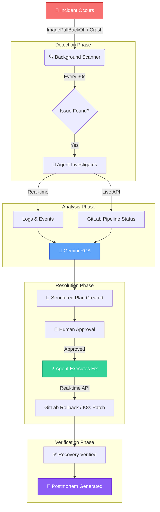

# 🛡️ Kubi AI: Autonomous Kubernetes Recovery Platform

Kubi AI is an enterprise-grade autonomous operations platform designed to monitor, analyze, and recover Kubernetes workloads from failures in real-time. Powered by **Google Gemini**, it provides SRE-grade root cause analysis (RCA) and automated remediation plans with a human-in-the-loop authorization workflow.

Unlike traditional AI chatbots that only provide recommendations, Kubi AI actively performs operational SRE tasks through multi-step reasoning and tool execution while keeping humans in control of critical actions.

The platform continuously monitors Kubernetes clusters, deployment pipelines, and observability data. When an incident occurs—such as a failed deployment, crashing pods, or unhealthy services—it automatically gathers logs, metrics, deployment history, and cluster events using integrations such as Elastic MCP and GitLab MCP.

### 🧠 Core SRE Agent Capabilities
*   **Kubernetes Incident Detection**: Automatic scanner monitors pod health, OOMKills, and crash loops at 30s intervals.
*   **AI-Driven Root Cause Analysis**: Synthesizes logs, events, metrics, and git metadata into actionable insights.
*   **CI/CD Pipeline Investigation**: Live checks on deployment pipelines and autonomous rollback triggers via GitLab API.
*   **Structured Remediation Hub**: Safe multi-step recovery executions with human approval gates.
*   **Automated Postmortem Generation**: Instant compliance reports in markdown summarizing root cause, impact, and actions.
*   **Modern Premium Dashboard**: High-density interactive UI built with **Next.js 15**, **MUI**, **Shadcn UI**, and **Tailwind 4**.
*   **Observability & Analytics**: Integrated **Arize AX** telemetry and **Elasticsearch** semantic vector search.

---

## 🧠 Autonomous Recovery Pipeline

Kubi AI follows a sophisticated, real-time workflow to maintain cluster health without manual intervention:



---

## 📚 Documentation Index

We maintain unified, single-source technical reference documents for all core subsystems:

### 🚀 Getting Started
- **[Local Development Setup](./docs/LOCAL_SETUP.md)**: Complete guide for setting up Kubi AI on your local machine for development.
- **[Deployment Guide](./docs/DEPLOYMENT.md)**: Docker Compose, Minikube, Kustomize, Helm chart, and GCP environment configuration strategies.
- **[Commands Reference](./docs/COMMANDS.md)**: Comprehensive reference of all build, deploy, test, and utility commands.

### 🏗️ Technical Deep Dives
- 🛰️ **[Arize AX Tracing & Telemetry](./docs/ARIZE.md)**: Production-grade observability, telemetry installation, and sensitive data redaction policies.
- 🔍 **[Elasticsearch Setup & Integration](./docs/ELASTICSEARCH.md)**: Asynchronous indexing, schema mapping, and RAG context building for AI reasoning.
- 🧪 **[SRE Testing Checklist](./docs/checks.md)**: Standard SRE scenarios, Gemini verification curl scripts, and UI analyzer parameters.
- 🐳 **[Docker & Minikube Host Setup](./docs/docker_minikube_integration.md)**: Network architecture, host-to-container certificate mapping, and loopback TLS hostname verification bypasses.
- 📈 **[Release Changelog](./docs/CHANGES.md)**: Historical structural transitions, monorepo migrations, and milestone logs.

---

## 📁 Directory Structure

The project is organized as an enterprise-grade monorepo:

```
kubi/
├── apps/                        # Primary service components
│   ├── backend/                 # FastAPI backend service
│   ├── frontend/                # Next.js MUI/Tailwind dashboard
│   └── agent/                   # Kubernetes background scanner agent
├── deploy/                      # Deployment manifests & charts
│   ├── k8s/                     # Kubernetes Kustomize manifests
│   └── container/               # Docker Compose orchestrations
├── docs/                        # Technical guides & architectural docs
└── README.md                    # Main monorepo workspace entrypoint
```

---

## 🛠️ Technology Stack & Architecture

Kubi AI is organized as a high-performance monorepo, separating concerns between user interface, daemon-level agents, and orchestrating API layers.

### 🖥️ Frontend (`apps/frontend`)
*The SRE Command Center for real-time cluster operations and approval workflows.*

| Technology | Purpose | Module Path |
| :--- | :--- | :--- |
| **Next.js 15** | Core framework for the high-performance server-side rendered dashboard. | `apps/frontend/` |
| **TypeScript** | Type safety across UI components, API interfaces, and state objects. | `apps/frontend/src/` |
| **Tailwind CSS 4** | Utility-first styling for a sleek, responsive, and modern dark-mode UI. | `apps/frontend/src/app/index.css` |
| **Material UI (MUI)** | Enterprise-grade component library for complex interactive cluster tables. | `apps/frontend/src/components/` |
| **Shadcn UI** | Accessible, beautifully designed modular primitive controls. | `apps/frontend/src/components/ui/` |
| **Framer Motion** | Powers smooth micro-animations and status transition states. | `apps/frontend/src/components/` |

### ⚙️ Backend (`apps/backend`)
*The asynchronous ingestion and database engine driving autonomous incident recovery.*

| Technology | Purpose | Module Path |
| :--- | :--- | :--- |
| **FastAPI** | High-performance Python framework exposing incident APIs and cluster handlers. | `apps/backend/app/main.py` |
| **MongoDB** | Primary persistence layer storing incident logs, postmortems, and settings. | Database Container |
| **Motor (Async)** | Asynchronous Python driver facilitating non-blocking MongoDB communication. | `apps/backend/app/db/` |
| **Pydantic v2** | Strict schema verification, data validation, and settings management. | `apps/backend/app/schemas/` |
| **Elasticsearch 8.13.4** | Vector search and semantic incident querying for RAG-based context resolution. | `apps/backend/app/services/` |

### 🕵️‍♂️ Agent Daemon (`apps/agent`)
*The autonomous background cluster watch and remediation worker.*

| Technology | Purpose | Module Path |
| :--- | :--- | :--- |
| **Python 3.11+** | High-efficiency event-driven monitoring daemon. | `apps/agent/` |
| **Kubernetes SDK** | Direct API communication to watch cluster pod transitions and stream logs. | `apps/agent/kubernetes_client/` |
| **Arize AX Tracing** | Production-grade observability, telemetry collection, and span exporter. | `apps/agent/arize_tracing.py` |

### 🧠 AI & Observability Layer
*The intelligence core powered by Google Gemini and instrumented by Arize.*
- **Gemini 1.5 Pro / Flash**: Handles complex multi-step Root Cause Analysis (RCA) and plans recovery steps.
- **RCA Engine**: Dynamically analyzes pod statuses, logs, and events to extract meaningful failures.
- **Arize AX Telemetry**: Fully traces LLM prompt execution, token sizes, external client times, and sanitizes sensitive credentials before transmitting traces.

### 🏗️ Infrastructure & Orchestration
*Cloud-native distribution configurations.*
- **Docker & Compose**: Containerization strategy providing uniform environments across dev and prod (`deploy/container/`).
- **Kustomize**: Template-free, clean configuration overlay engine for managing secrets, resources, and endpoints (`deploy/k8s/`).


---

## 📦 Quick Start (Docker Compose)

Launch the entire stack (Next.js, FastAPI, Agent, MongoDB) with a single command from the root directory:

### Windows (PowerShell)

```powershell
.\deploy.ps1 docker
```

### macOS / Linux (Bash)

```bash
chmod +x deploy.sh
./deploy.sh docker
```

For more advanced setups, including local Kubernetes deployments, see the **[Deployment Guide](./docs/DEPLOYMENT.md)**.

---

## 🛡️ Security & RBAC

Kubi AI respects Kubernetes RBAC principles. All auto-remediations run inside designated service accounts and strictly respect human approval gates in the dashboard. Telemetry spans filter out and redact authorization tokens and keys locally before dispatch.

---

## 📄 License

This project is licensed under the **[MIT License](./LICENSE)** - an OSI-approved open-source license.

