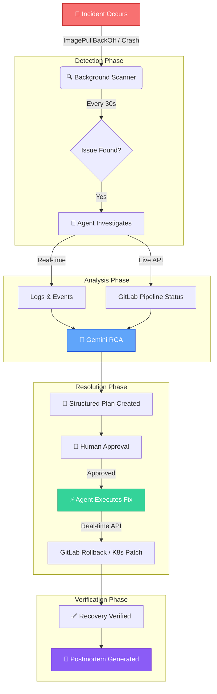

# 🛡️ Kubi AI: Autonomous Kubernetes Recovery Platform

Kubi AI is an enterprise-grade autonomous operations platform designed to monitor, analyze, and recover Kubernetes workloads from failures in real-time. Powered by **Google Gemini**, it provides SRE-grade root cause analysis (RCA) and automated remediation plans with a human-in-the-loop authorization workflow.

---

## 🚀 Key Features

- **Autonomous Monitoring**: Real-time scanning of Kubernetes namespaces for pod failures, OOMKills, and crash loops (30s intervals).
- **AI-Driven RCA**: Leverages Google Gemini to synthesize logs, events, and metrics into actionable root cause insights.
- **GitLab Integration**: Live checks on deployment pipelines and autonomous rollback triggers via GitLab API.
- **Remediation Hub**: Structured review process to review, approve, or execute AI-generated recovery sequences.
- **SRE Postmortems**: Automated generation of detailed markdown reports for incident documentation and compliance.
- **Premium Dashboard**: High-density UI built with **Next.js 15**, **MUI**, **Shadcn UI**, and **Tailwind 4**.
- **Observability & Analytics**: Integrated **Arize AX** telemetry and **Elasticsearch** semantic vector search.

---

## 🧠 Autonomous Recovery Pipeline

Kubi AI follows a sophisticated, real-time workflow to maintain cluster health without manual intervention:



---

## 📚 Documentation Index

We maintain unified, single-source technical reference documents for all core subsystems:

### 🚀 Getting Started
- **[Local Development Setup](./docs/LOCAL_SETUP.md)**: Complete guide for setting up Kubi AI on your local machine for development.
- **[Deployment Guide](./docs/DEPLOYMENT.md)**: Docker Compose, Minikube, Kustomize, and Helm deployment strategies.
- **[Commands Reference](./docs/COMMANDS.md)**: Comprehensive reference of all build, deploy, test, and utility commands.

### 🏗️ Technical Deep Dives
- 🛰️ **[Arize AX Tracing & Telemetry](./docs/ARIZE.md)**: Production-grade observability, telemetry installation, and sensitive data redaction policies.
- 🔍 **[Elasticsearch Setup & Integration](./docs/ELASTICSEARCH.md)**: Asynchronous indexing, schema mapping, and RAG context building for AI reasoning.
- 🧪 **[SRE Testing Checklist](./docs/checks.md)**: Standard SRE scenarios, Gemini verification curl scripts, and UI analyzer parameters.
- 🛠️ **[Detailed Technology Stack](./docs/STACK.md)**: Breakdown of framework versions, components, and module mappings.
- 📈 **[Release Changelog](./docs/CHANGES.md)**: Historical structural transitions, monorepo migrations, and milestone logs.
- 📊 **[Kubernetes Logging](./docs/KUBERNETES_LOGGING.md)**: Advanced Kubernetes logging and observability setup.

---

## 📁 Directory Structure

The project is organized as an enterprise-grade monorepo:

```
kubi/
├── apps/                        # Primary service components
│   ├── backend/                 # FastAPI backend service
│   ├── frontend/                # Next.js MUI/Tailwind dashboard
│   └── agent/                   # Kubernetes background scanner agent
├── deploy/                      # Deployment manifests & charts
│   ├── k8s/                     # Kubernetes Kustomize manifests
│   └── container/               # Docker Compose orchestrations
├── docs/                        # Technical guides & architectural docs
└── README.md                    # Main monorepo workspace entrypoint
```

---

## 📦 Quick Start (Docker Compose)

Launch the entire stack (Next.js, FastAPI, Agent, MongoDB) with a single command from the root directory:

### Windows (PowerShell)

```powershell
./deploy-docker.ps1
```

### macOS / Linux (Bash)

```bash
chmod +x deploy-docker.sh
./deploy-docker.sh
```

For more advanced setups, including local Kubernetes deployments, see the **[Deployment Guide](file:///c:/Users/shubh/Downloads/repo/kubi/docs/DEPLOYMENT.md)**.

---

## 🛡️ Security & RBAC

Kubi AI respects Kubernetes RBAC principles. All auto-remediations run inside designated service accounts and strictly respect human approval gates in the dashboard. Telemetry spans filter out and redact authorization tokens and keys locally before dispatch.

---

## 📄 License

This project is licensed under the **[MIT License](file:///c:/Users/shubh/Downloads/repo/kubi/LICENSE)** - an OSI-approved open-source license.
