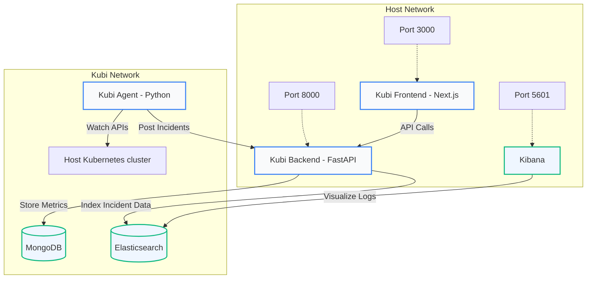
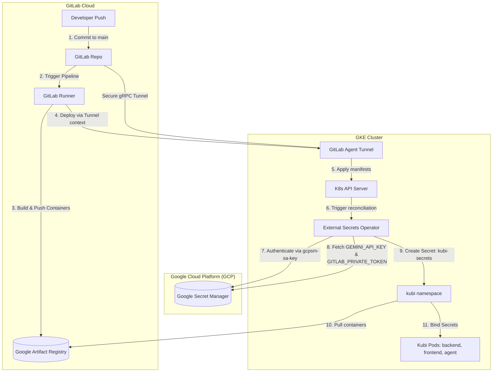

# 📋 Master Deployment & Operations Runbook

This guide is the unified, production-grade master deployment guide for the **Kubi AI Autonomous SRE Platform**. It consolidates all deployment strategies—including **Docker Compose local development**, **local Minikube orchestration**, **manual Kustomize overlays**, and **production GKE cloud deployments with GitOps & Fluent Bit pipelines**—under a single, cohesive handbook.

For a streamlined operations experience, all environments utilize our cross-platform orchestrator wrappers:
*   💻 **Windows PowerShell**: [`./deploy.ps1`](file:///c:/Users/shubh/Downloads/repo/kubi/deploy.ps1)
*   🍎 **macOS / Linux Bash**: [`./deploy.sh`](file:///c:/Users/shubh/Downloads/repo/kubi/deploy.sh)

---

## 🏗️ End-to-End System Topologies

### 1. Local Container Stack (Docker Compose)
In Docker Compose mode, all SRE services run inside an isolated network bridging host boundaries.



### 2. GKE Production GitOps & Hydration Topology
Production pipelines automate container building and secret hydration using Google Secret Manager and External Secrets Operator.



---

## 📋 General Prerequisites

Ensure the following tools are installed and configured on your host system:
*   **Docker Desktop & Engine**: [Install Docker](https://www.docker.com/products/docker-desktop/) (must be actively running).
*   **kubectl**: [Install kubectl](https://kubernetes.io/docs/tasks/tools/) (target cluster CLI client).
*   **Minikube**: [Install Minikube](https://minikube.sigs.k8s.io/docs/start/) (required for local Kubernetes integration).
*   **Helm**: [Install Helm](https://helm.sh/docs/intro/install/) (required for packaged chart releases).
*   **Google Cloud SDK**: [Install gcloud](https://cloud.google.com/sdk/docs/install) (required for GKE clusters).

---

## ⚡ Deployment Playbooks via Unified Orchestrator

The unified script dynamically bootstraps your targets. If run without arguments, it displays full command helper instructions.

```powershell
# PowerShell helper
./deploy.ps1 -Help

# Bash helper
./deploy.sh --help
```

---

### 1️⃣ Local Docker Compose Stack

This strategy builds and boots the core platform inside a local container network, mapping the local ports:
*   **Frontend Console**: `http://localhost:3000`
*   **FastAPI Backend**: `http://localhost:8000`
*   **Kibana Panel**: `http://localhost:5601`

Docker Compose also accepts the same local public URL variables used by the Kubernetes overlay:
*   `FRONTEND_URL` defaults to `http://kubi.kontactless.in`
*   `BACKEND_URL` defaults to `http://backend.kubi.kontactless.in`
*   `AGENT_URL` defaults to `http://agent.kubi.kontactless.in`
*   `NEXT_PUBLIC_API_URL` defaults to `${BACKEND_URL}/api`

Container-to-container traffic still uses Docker service names internally, such as `http://be:8000` for backend calls and `http://agent:8080` for agent calls.

```bash
# PowerShell
./deploy.ps1 docker

# Bash
./deploy.sh docker
```

#### Manual Alternative
```bash
docker compose -f deploy/container/docker-compose.yml up --build -d
```

---

### 2️⃣ Local Kubernetes In-Cluster Stack (Minikube)

Deploys the local manifest overlay inside your active Minikube cluster. The local overlay creates the Kubi Ingress object, but the Minikube ingress controller must be enabled separately before `http://kubi.kontactless.in` can open in a browser.

```bash
# 1. Boot Minikube node
minikube start --driver=docker

# 2. Enable the Minikube ingress controller once per cluster
minikube addons enable ingress
kubectl rollout status deployment/ingress-nginx-controller -n ingress-nginx --timeout=180s

# 3. PowerShell deployment
./deploy.ps1 minikube-local

# 4. Bash deployment
./deploy.sh minikube-local
```

For local URL configuration, `deploy.ps1` and `deploy.sh` write defaults into `deploy/k8s/overlays/local/.env`. Kustomize generates `kubi-local-config` from that file, then copies only `BACKEND_URL`, `AGENT_URL`, and `FRONTEND_URL` into the base `kubi-config` ConfigMap. This avoids manually editing `configmap-patch.yaml` for local URLs and avoids replacing the full base ConfigMap.

#### Connecting Additional Kubernetes Clusters

The recommended model is to deploy a Kubi agent inside each Kubernetes cluster and register its reachable URL in Kubi using agent authentication.

```bash
# Create the namespace, then deploy only the Kubi agent resources
kubectl --context <remote-context> apply -f deploy/k8s/base/namespace.yaml
kubectl --context <remote-context> apply -k deploy/k8s/agent
```

Select the agent URL based on where the Kubi backend runs:

| Scenario | Cluster connection settings |
| :--- | :--- |
| Backend and agent are in the same cluster | `auth_type=agent`, `agent_url=http://kubi-agent-service.kubi.svc.cluster.local:8080` |
| Backend reaches an agent through private DNS or an internal load balancer | `auth_type=agent`, `agent_url=http://<private-agent-host>:8080` |
| Backend reaches an agent over an external ingress | `auth_type=agent`, `agent_url=https://agent.<remote-domain>` |
| Local Minikube ingress testing | `auth_type=agent`, `agent_url=http://agent.kubi.kontactless.in` |

Before registering an exposed agent, verify that the Kubi backend network can reach:

```text
GET <agent_url>/healthz
GET <agent_url>/stats
```

External agent endpoints must use TLS and should require authentication, firewall restrictions, or private networking. The local Minikube URL `http://agent.kubi.kontactless.in` is intended only for local testing and is normally not reachable from a remote backend.

The agent URL is not a Kubernetes API server endpoint. Do not use an agent URL with `auth_type=direct`, and do not place it in a kubeconfig `clusters[].cluster.server` field. Direct mode requires the real remote Kubernetes API endpoint plus restricted credentials:

```text
auth_type=direct
api_endpoint=https://<remote-kubernetes-api>:6443
ca_cert=<cluster-ca>
client_cert=<restricted-client-certificate>
client_key=<restricted-client-key>
```

#### Adapted Host-to-Container Minikube Integration
If you choose to run the agent inside a Docker container while Minikube is on the host, adapt the credentials profile mount paths:
1.  **Configure Loopback Gateways**: Replace target cluster server port configurations from `127.0.0.1:<port>` to `host.docker.internal:<port>`.
2.  **Mount Certificates Read-Only**: Mount your local Minikube certificates root into the container space inside `docker-compose.yml`:
    ```yaml
    volumes:
      - C:\Users\<USERNAME>\.minikube:/root/.minikube:ro
      - ./deploy/kubeconfig:/root/.kube/config:ro
    ```
3.  **Bypass TLS Assertion**: Since certificates are mapped for localhost gateways, configure python cluster clients to ignore assertion matching:
    ```python
    configuration = client.Configuration.get_default_copy()
    configuration.assert_hostname = False
    client.Configuration.set_default(configuration)
    ```

---

### 3️⃣ Production Packaged Releases (Helm Charts)

Using Helm provides linting, version control, structured release rollouts, and single-command rollbacks.

```bash
# 1. Perform static analysis and linting
helm lint deploy/helm/

# 2. Run dry-run compilation checks
helm install kubi deploy/helm/ --namespace kubi --create-namespace --values deploy/helm/values-prod.yaml --dry-run --debug

# 3. Perform production release installation
# PowerShell
./deploy.ps1 helm

# Bash
./deploy.sh helm
```

#### Essential Helm Management Registry
*   **Upgrade Release**:
    ```bash
    helm upgrade kubi deploy/helm/ -n kubi --values deploy/helm/values-prod.yaml --wait
    ```
*   **Rollback Release**:
    ```bash
    # View history log
    helm history kubi -n kubi
    # Rollback to immediate previous or specific version (e.g. version 2)
    helm rollback kubi 2 -n kubi
    ```
*   **Uninstall Stack**:
    ```bash
    helm uninstall kubi -n kubi
    ```

---

### 4️⃣ Production Cloud Infrastructure (Google Kubernetes Engine - GKE)

For provisioning secure cloud-native environments, integrating IAM Service Accounts, and syncing with Google Secret Manager.

```bash
# PowerShell GKE setup
./deploy.ps1 gke

# Bash GKE setup
./deploy.sh gke
```

#### GCP Infrastructure & Secret Vault Mapping Guide

1.  **IAM Roles Assignment**:
    Bind roles to the Operator Service Account so GKE can fetch container layers and resolve Secret Manager values:
    ```bash
    gcloud projects add-iam-policy-binding <GCP_PROJECT_ID> --member="serviceAccount:<SA_NAME>@<GCP_PROJECT_ID>.iam.gserviceaccount.com" --role="roles/artifactregistry.writer"
    gcloud projects add-iam-policy-binding <GCP_PROJECT_ID> --member="serviceAccount:<SA_NAME>@<GCP_PROJECT_ID>.iam.gserviceaccount.com" --role="roles/secretmanager.secretAccessor"
    ```
2.  **Add Secrets Vault to GCP**:
    ```bash
    gcloud secrets create GEMINI_API_KEY --replication-policy="automatic"
    echo -n "<API_KEY>" | gcloud secrets versions add GEMINI_API_KEY --data-file=-
    ```
3.  **Map Secrets into GKE (External Secrets Operator)**:
    Establish a cluster secret store linking your GCP project, and define mapping contexts:
    ```yaml
    apiVersion: external-secrets.io/v1beta1
    kind: ExternalSecret
    metadata:
      name: kubi-external-secrets
      namespace: kubi
    spec:
      refreshInterval: 15m
      secretStoreRef:
        name: gcp-secret-store
        kind: ClusterSecretStore
      target:
        name: kubi-secrets
      data:
        - secretKey: GEMINI_API_KEY
          remoteRef:
            key: GEMINI_API_KEY
    ```

#### 🔐 Kubernetes Secrets & Environment Configurations

The `deploy/k8s/secrets/` directory is the single home for Kubernetes secret configurations.

##### 1. Secrets Layout Structure
*   **Local (`deploy/k8s/secrets/local/`)**: Creates a local `kubi-secrets` Kubernetes Secret from checked-in dummy values. Replace values locally before applying:
    ```bash
    kubectl apply -k deploy/k8s/secrets/local
    ```
*   **External (`deploy/k8s/secrets/external/gcp/`)**: Creates the same `kubi-secrets` Kubernetes Secret from GCP Secret Manager through the External Secrets Operator:
    ```bash
    kubectl apply -k deploy/k8s/secrets/external/gcp
    ```

Both local and production paths produce a Secret named `kubi-secrets` so workload manifests can reference one stable secret name. Never commit real API keys, tokens, or passwords to git.

##### 2. Complete Environment Variables Registry

| Variable | Source (K8s Secret) | Description |
| :--- | :--- | :--- |
| **DB_PASSWORD** | `db-password` (key `DB_PASSWORD`) | Database password for the MongoDB instance |
| **RESEND_API_KEY** | `resend-api-key` (key `RESEND_API_KEY`) | API key for Resend email service |
| **JWT_SECRET_KEY** | `jwt-secret` (key `JWT_SECRET_KEY`) | Secret used to sign JWT tokens |
| **GEMINI_API_KEY** | `gemini-api-key` (key `GEMINI_API_KEY`) | API key for the Gemini AI service |
| **GCP_PROJECT_ID** | (environment variable) | GCP project identifier for Secret Manager (empty in dev) |
| **GCP_REGION** | (environment variable) | GCP region/location for Secret Manager (empty in dev) |
| **GITLAB_TOKEN** | `gitlab-token` (key `GITLAB_TOKEN`) | Private token for GitLab API access |
| **ENVIRONMENT** | (static value) | Set to `production` for the prod overlay |
| **ARIZE_SPACE_ID** | `kubi-secrets` (key `ARIZE_SPACE_ID`) | Optional Arize AI space identifier |
| **ARIZE_API_KEY** | `kubi-secrets` (key `ARIZE_API_KEY`) | Optional Arize AI API key |
| **ARIZE_PROJECT_NAME** | (static value) | Arize project name (`kubi-prod-backend`) |
| **SSO_CLIENT_ID** | `kubi-secrets` (key `SSO_CLIENT_ID`) | SSO client identifier |
| **SSO_CLIENT_SECRET** | `kubi-secrets` (key `SSO_CLIENT_SECRET`) | SSO client secret |

> [!NOTE]
> All secret names are referenced in **UPPERCASE** as required by project policy. In development, the `GCP_PROJECT_ID` and `GCP_REGION` variables are left empty; they are populated by the production overlay via GCP Secret Manager.

---


## 🪵 Production Log Forwarding: Fluent Bit

Fluent Bit runs as a cluster-wide DaemonSet inside the `kube-system` namespace. It tails log streams from `/var/log/containers/*.log`, merges Kubernetes pod metadata (labels, namespace, annotations), and routes vectorized entries directly to Elasticsearch.

Apply the daemon config-maps and set coordinates inside your templates:
```bash
kubectl apply -f deploy/fluent-bit-configmap.yaml
kubectl apply -f deploy/fluent-bit-daemonset.yaml
```

---

## 📋 Standard Management Commands

| Operational Task | Commands Registry |
| :--- | :--- |
| **Check Docker Stack status** | `docker compose -f deploy/container/docker-compose.yml ps` |
| **Stream container logs** | `docker compose -f deploy/container/docker-compose.yml logs -f [be/fe]` |
| **Check K8s workload state** | `kubectl get pods -n kubi -o wide` |
| **Check service endpoints** | `kubectl get service -n kubi` |
| **Stream pod stdout logs** | `kubectl logs deployment/kubi-backend -n kubi -f --tail=100` |
| **Trigger manual rollout restart** | `kubectl rollout restart deployment/kubi-backend -n kubi` |

---

## 🔍 Troubleshooting & Resolution Registry

### ❌ Docker Daemon Connection Failures
*   **Symptoms**: `Cannot connect to the Docker daemon. Is the docker daemon running?`
*   **Fix**: Launch Docker Desktop, wait for the daemon initialization phase, and verify with `docker ps`.

### ❌ Local Ingress Host Does Not Open
*   **Symptoms**: Firefox or another browser cannot connect to `http://kubi.kontactless.in` after `./deploy.ps1 minikube-local`.
*   **Cause**: The deployment applied the Kubi Ingress manifest, but the Minikube ingress controller is not running.
*   **Fix**:
    ```bash
    minikube addons enable ingress
    kubectl rollout status deployment/ingress-nginx-controller -n ingress-nginx --timeout=180s
    kubectl get pods -n ingress-nginx
    kubectl get ingress -n kubi
    ```
*   **Fallback access**: Use `minikube service kubi-frontend-service -n kubi` if ingress is unavailable.

### ❌ Elasticsearch Boot Failures (OOM)
*   **Symptoms**: The Elasticsearch pod repeatedly crashes or exits with code `137` (Out of Memory).
*   **Fix**: Local Elasticsearch instances require at least 512MB to 1GB of dedicated heap memory. Increase Docker Desktop system memory allocation (recommend >= 4GB overall allocated resources).

### ❌ TLS Hostname Exception inside local Minikube
*   **Symptoms**: Agent log displays `SSLCertVerificationError: host.docker.internal does not match CA certificates`.
*   **Fix**: Update targeted configuration properties in client definitions to bypass assert hostname validations:
    `configuration.assert_hostname = False`

### Agent URL Returns 404 or Connects to Port 443
*   **Symptoms**: Agent logs show `GET /api/v1/namespaces ... 404 Not Found`, or validation reports `Could not connect at agent.kubi.kontactless.in:443`.
*   **Cause**: The agent URL was configured as a direct Kubernetes API endpoint, or HTTPS was used against the local HTTP-only Minikube ingress.
*   **Fix**: Select agent authentication and use the complete URL:
    ```text
    auth_type=agent
    agent_url=http://agent.kubi.kontactless.in
    ```
*   **Production/remote clusters**: Use `https://agent.<remote-domain>` only after configuring ingress TLS and making the endpoint reachable from the Kubi backend.
*   **Validation**: `<agent_url>/healthz` and `<agent_url>/stats` must return HTTP `200`. The agent does not serve Kubernetes API paths such as `/api/v1/namespaces`.

### ❌ Rate Limit Throttling (429 Too Many Requests)
*   **Symptoms**: Quick REST API updates return a `429` status error code.
*   **Fix**: Ensure `rate_limit_key` is scoped specifically per endpoint path in `security.py` rather than globally per client IP:
    `rate_limit_key = f"{ip}:{request.url.path}"`
