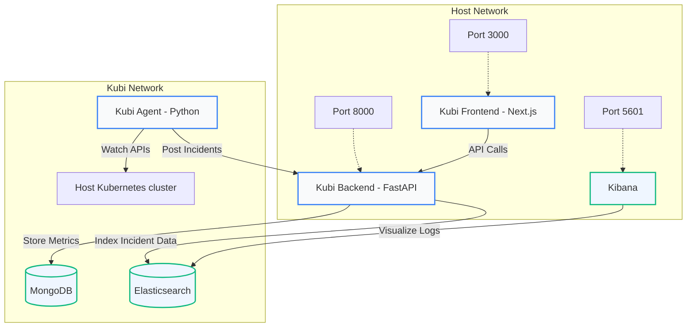

# 🐳 Docker & Docker Compose Deployment Guide: Kubi AI

This guide details how to build, deploy, and manage the complete **Kubi AI** application stack locally using **Docker** and **Docker Compose**. This deployment model is perfect for local development, debugging, testing, and demonstrating the platform.

---

## 📋 Prerequisites

Ensure your host system meets the following requirements before executing the deployment:

* **Docker Engine & Docker Desktop**: [Download & Install](https://www.docker.com/products/docker-desktop/) (ensure the daemon is running).
* **Gemini API Key**: Required by the backend service for AI-driven Root Cause Analysis (RCA). Get one from [Google AI Studio](https://aistudio.google.com/).
* **Minikube** (Optional): If you wish to test the Kubi Agent's integration with an active local Kubernetes cluster, Minikube should be running so the agent can mount its configurations.

---

## 🏗️ Architecture & Topology

The Docker Compose configuration (`deploy/container/docker-compose.yml`) orchestrates **7 interconnected services** inside an isolated network:



---

## ⚡ Quick Start: Automatic Deployment

We provide cross-platform automated wrapper scripts that detect your engine state, load variables from your backend configuration, build dependencies, and orchestrate the stack in detached mode.

### 💻 For Windows (PowerShell)
Open a PowerShell prompt as an Administrator, navigate to the repository root, and run:
```powershell
./deploy-docker.ps1
```

### 🍎 For macOS / Linux (Bash)
Open your terminal, navigate to the repository root, mark the script as executable, and run:
```bash
chmod +x deploy-docker.sh
./deploy-docker.sh
```

---

## 🛠️ Step 2: Manual Deployment (Alternative)

If you prefer to run raw commands without the wrapper scripts, execute the following steps from the root directory:

### 1️⃣ Set up Environment Configuration
Ensure your FastAPI backend contains a valid configuration file. Copy the sample env or edit [`apps/backend/.env`](file:///c:/Users/shubh/Downloads/repo/kubi/apps/backend/.env) to include your Google Gemini API key:

```env
GEMINI_API_KEY=AIzaSy...
```

### 2️⃣ Build and Start Services
Execute `docker compose` to build the local microservice images and spin them up in the background:

```bash
docker compose -f deploy/container/docker-compose.yml up --build -d
```

---

## 🧪 Local Observability: Arize Phoenix Tracing

Kubi AI supports dual-mode telemetry tracing using **Arize AX & Phoenix**. By default, tracing is disabled in development unless you launch a local Phoenix collector or supply Arize space keys.

To run local tracing in your Docker stack:

1. Spin up an Arize Phoenix collector locally on your host machine:
   ```bash
   pip install arize-phoenix
   python -m phoenix.server.main serve
   ```
2. Note your local collector endpoint (typically `http://localhost:6006/v1/traces` or `http://127.0.0.1:6006`).
3. Set the following environment variables in your active shell or inside `apps/backend/.env`:
   ```env
   ENVIRONMENT=development
   PHOENIX_COLLECTOR_ENDPOINT=http://host.docker.internal:6006/v1/traces
   ```
4. Restart your compose services to begin streaming traces from backend and agent containers:
   ```bash
   docker compose -f deploy/container/docker-compose.yml restart be agent
   ```

---

## 🎭 Running Playwright E2E Tests in Docker

You can execute end-to-end browser regression testing directly inside your container network:

```bash
# Run headless/headed tests inside docker-compose
docker compose -f deploy/container/docker-compose.yml run playwright
```

---

## 📋 Standard Management Commands

Use these commands from the repository root to maintain your container state:

| Command | Action |
|:---|:---|
| `docker compose -f deploy/container/docker-compose.yml ps` | Check container health status |
| `docker compose -f deploy/container/docker-compose.yml logs -f` | Stream consolidated logs from all containers |
| `docker compose -f deploy/container/docker-compose.yml logs -f be` | Stream logs only from the Backend container |
| `docker compose -f deploy/container/docker-compose.yml logs -f agent` | Stream logs only from the Agent container |
| `docker compose -f deploy/container/docker-compose.yml restart [service]` | Restart a specific container (e.g. `be`, `fe`, `agent`) |
| `docker compose -f deploy/container/docker-compose.yml down` | Terminate all running containers and preserve volumes |
| `docker compose -f deploy/container/docker-compose.yml down -v` | Terminate all containers **and destroy database volumes** (data wipe) |

---

## 🔍 Troubleshooting

### ❌ Docker Daemon Connection Failures
* **Error**: `Cannot connect to the Docker daemon. Is the docker daemon running?`
* **Fix**: Ensure Docker Desktop is launched and showing a green "Running" status indicator on your taskbar.

### ❌ Elasticsearch Boot Failures (OutOfMemory)
* **Error**: Elasticsearch container exits shortly after starting with code `137`.
* **Fix**: The default Elasticsearch instance requires up to 512MB RAM. If Docker Desktop's resource limit is set too low on your system, increase it in **Docker Desktop Settings** -> **Resources** -> **Memory** (recommend at least 4GB of overall memory allocated to Docker).

### ❌ Gemini AI Remediation not working
* **Symptoms**: UI dashboard displays incident events, but Root Cause Analysis (RCA) or remediation script suggestions remain blank.
* **Fix**: Ensure `GEMINI_API_KEY` is defined correctly in your `apps/backend/.env` file and verify by restarting:
  ```bash
  docker compose -f deploy/container/docker-compose.yml restart be
  ```
