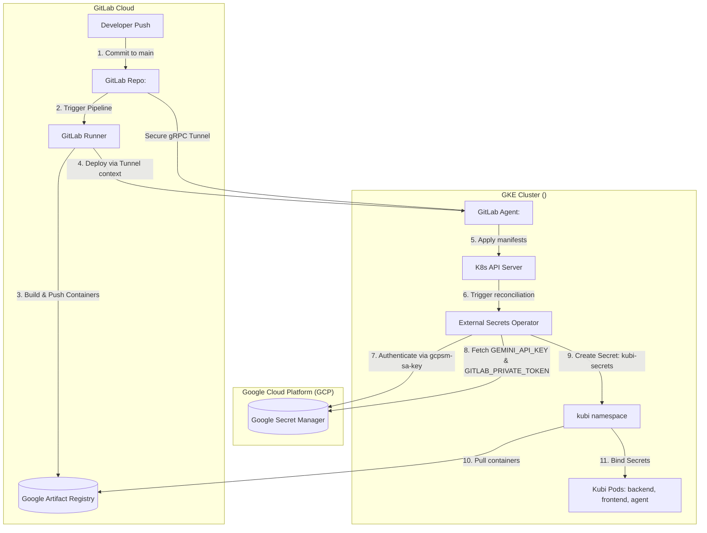

# 📋 Master Kubernetes & GitOps Operations Runbook

This master operations guide provides a unified, production-grade runbook for the **Kubi AI SRE Platform**. It aggregates and organizes all local container configurations, Minikube orchestration, manual Kubernetes (Kustomize) setups, versioned Helm deployments, secure cloud-native Google Kubernetes Engine (GKE) setups, GitLab CI/CD secure Agent Tunnel workflows, and the Fluent Bit log forwarding pipeline.

All sensitive configurations (project IDs, cluster names, access keys, private directory paths, and usernames) have been fully redacted and replaced with generic variable placeholders.

---

## 📌 Prerequisites & Variable Reference

### Prerequisites
Before executing any deployment sequence, ensure the following core tools are installed and configured:
- **Docker Desktop**: [Download Docker](https://www.docker.com/products/docker-desktop/) (ensure the docker daemon is active).
- **kubectl**: [Install kubectl CLI](https://kubernetes.io/docs/tasks/tools/) (required to run commands against the target cluster).
- **Minikube**: [Install Minikube](https://minikube.sigs.k8s.io/docs/start/) (required for local orchestration/testing).
- **Google Cloud SDK (gcloud CLI)**: [Install Google Cloud SDK](https://cloud.google.com/sdk/docs/install) (required for GKE authentication).
- **Helm**: [Install Helm](https://helm.sh/docs/intro/install/) (required for versioned package deployments).

---

### Environment Variable Reference
Prior to running commands, substitute the following variable placeholders with your specific environmental values:

| Variable Placeholder | Description | Example / Format |
| :--- | :--- | :--- |
| `<GCP_PROJECT_ID>` | The unique ID of your Google Cloud project | `my-gcp-project-12345` |
| `<GKE_CLUSTER_NAME>` | The name of your active GKE cluster | `kubi-prod-cluster` |
| `<GKE_CLUSTER_REGION>` | The GCP region hosting your GKE cluster | `us-central1` or `asia-south1` |
| `<SERVICE_ACCOUNT_NAME>` | Google Cloud Service Account for IAM authentication | `kubi-operator-sa` |
| `<GITLAB_AGENT_NAME>` | Registered name of the GitLab CI/CD tunnel agent | `kubi-cd-agent` |
| `<GITLAB_REPO_PATH>` | Path of your GitLab repository | `my-organization/kubi-platform` |
| `<GITLAB_ACCESS_TOKEN>` | Private token with `write_repository` access | `glpat-abcdef1234567890` |
| `<GEMINI_API_KEY>` | API key for Google Gemini AI RCA generation | `AIzaSyD-abc123xyz` |
| `<MONGODB_SECRET_PASSWORD>`| Root password for MongoDB storage instances | `MySuperSecurePass123` |
| `<ELASTIC_USER>` | Username for Elasticsearch logging cluster | `elastic` |
| `<ELASTIC_PASSWORD>` | Password for Elasticsearch log ingestion | `ES-SecretPassword` |
| `<KUBI_DOMAIN>` | Domain address where the SRE dashboard is served | `kubi.example.com` |
| `<WORKSPACE_DIR>` | Root directory of local git repository clone | `C:\Users\<USERNAME>\Downloads\repo\kubi` |
| `<USERNAME>` | Host system username | `sre-admin` |

---

## 🏗️ End-to-End GitOps & Logging Architecture

The production-grade deployment combines a push-based GitOps loop leveraging the native **GitLab CI/CD Tunnel**, the Kubernetes **External Secrets Operator (ESO)** for credential hydration from **Google Secret Manager (GSM)**, and a log forwarding pipeline.

### GitOps Loop & Credential Hydration


### Logging & Diagnostic Pipeline
```
Kubernetes Workload Pods (kubi namespace)
         ↓ (Logs printed to stdout/stderr)
Fluent Bit DaemonSet (kube-system namespace)
         ↓ (Collected, filtered, parsed)
Elasticsearch Ingestion Service (9200)
         ↓ (Vectorized & Indexed)
Gemini RCA Engine (Context-aware search queries)
```

---

## 🐳 1. Local Container Deployment (Docker Compose)

The fastest method to compile and launch the entire monorepo stack (Next.js Frontend, FastAPI Backend, MongoDB Database, and Agent Daemon) locally is via our container wrappers.

### Windows (PowerShell)
Execute the script from the repository root:
```powershell
./deploy-docker.ps1
```

### macOS / Linux (Bash)
Make the script executable and execute it from the repository root:
```bash
chmod +x deploy-docker.sh
./deploy-docker.sh
```

### Script Execution Logic
1. **Engine Validation**: Automatically scans host system to confirm Docker and Docker Compose environments are active.
2. **Environment Loading**: Reads and parses environmental configurations from `apps/backend/.env`.
3. **Compose Orchestration**: Initiates container definition sets defined in [`deploy/container/docker-compose.yml`](file:///<WORKSPACE_DIR>/deploy/container/docker-compose.yml).
4. **Detached Run**: Spins up the entire multi-container application stack in background detached modes.

---

## ☸️ 2. Local Kubernetes Deployment (Minikube)

For testing Kubernetes resources locally, utilize Minikube alongside our custom automation scripts.

### 1. Boot Minikube
Start your local minikube node using the Docker virtualization driver:
```bash
minikube start --driver=docker
```

### 2. Execute Deployment Script
Initialize the multi-layer manifest application from your repository root:

#### Windows (PowerShell)
```powershell
./deploy-minikube.ps1
```

#### macOS / Linux (Bash)
```bash
chmod +x deploy-minikube.sh
./deploy-minikube.sh
```

### 3. Access SRE Dashboard
Once all deployments finish successfully, spin up a Minikube network ingress tunnel to route traffic to the frontend service:
```bash
minikube service kubi-frontend-service -n kubi
```
*Note: This maps the Minikube node port to a local localhost adapter port and automatically opens the browser targeting the Kubi AI SRE Dashboard.*

---

## ☁️ 3. Production/Manual Kubernetes Deployment (Kustomize)

For standard or remote cloud installations where package management tools are not preferred, deploy base sets directly via Kustomize overlays.

### 1. Prepare Environments & Secrets
Provide configurations inside [`deploy/k8s/be/.env`](file:///<WORKSPACE_DIR>/deploy/k8s/be/.env):
```env
GEMINI_API_KEY=<GEMINI_API_KEY>
```

### 2. Apply Core Cluster Base
Configure standard namespaces and system configmaps:
```bash
kubectl apply -f deploy/k8s/base/namespace.yaml
kubectl apply -f deploy/k8s/base/configmap.yaml
```

### 3. Roll Out Platform Resources
Direct Kustomize to compile, render, and apply resources defined across overlays:
```bash
kubectl apply -k deploy/k8s/
```

Verify that all workloads transitioned to active running states:
```bash
kubectl get deployments -n kubi
kubectl get pods -n kubi
```

---

## 🎯 4. Production Deployment with Helm

**Helm** is the recommended deployment method for production environments, providing full state release logs, linting verification, upgrades, and structured rollbacks.

### 1. Helm Chart Structure
Our standardized Kubi Chart layout:
```
deploy/helm/
├── Chart.yaml              # Chart metadata (API version, details)
├── values.yaml             # Baseline parameters (Defaults)
├── values-prod.yaml        # Production overrides
├── values-staging.yaml     # Staging overrides
└── templates/              # Resource manifest templates
    ├── namespace.yaml
    ├── configmap.yaml
    ├── secrets.yaml
    ├── backend-deployment.yaml
    ├── frontend-deployment.yaml
    ├── agent-daemonset.yaml
    ├── mongodb-statefulset.yaml
    ├── services.yaml
    └── ingress.yaml
```

### 2. Standard Chart Verification & Installation

#### Perform Static Analysis & Linting
Validate chart structure and verify variable mapping syntax before executing rollouts:
```bash
helm lint deploy/helm/
```

#### Perform a Dry-Run & Debug
Generate and print rendered manifests to stdout for static inspection without altering cluster states:
```bash
helm install kubi deploy/helm/ \
  --namespace kubi \
  --create-namespace \
  --values deploy/helm/values-prod.yaml \
  --dry-run \
  --debug
```

#### Run Production Installation
Execute release installations, waiting until all database, agent, and api pods reach active running states:
```bash
helm install kubi deploy/helm/ \
  --namespace kubi \
  --create-namespace \
  --values deploy/helm/values-prod.yaml \
  --wait
```

#### Retrieve Deployments and Values
```bash
helm status kubi -n kubi
helm get values kubi -n kubi
kubectl get all -n kubi
```

---

### 3. Customize Production Overrides (`deploy/helm/values-prod.yaml`)
Customize GKE-native storage paths and load balancer integrations inside your production overlays file:

```yaml
# Database Configuration
mongodb:
  enabled: true
  auth:
    enabled: true
    password: "<MONGODB_SECRET_PASSWORD>"
  persistence:
    size: 50Gi
    storageClass: "premium-rwo" # GKE SSD Storage

# Backend Service
backend:
  replicas: 3
  image:
    tag: "v1.0.0"
  env:
    GEMINI_API_KEY: "<GEMINI_API_KEY>"
    LOG_LEVEL: "INFO"
  resources:
    requests:
      memory: "256Mi"
      cpu: "250m"
    limits:
      memory: "512Mi"
      cpu: "500m"

# Frontend Service
frontend:
  replicas: 2
  image:
    tag: "v1.0.0"
  resources:
    requests:
      memory: "128Mi"
      cpu: "100m"
    limits:
      memory: "256Mi"
      cpu: "200m"

# Agent Service
agent:
  enabled: true
  replicas: 1
  image:
    tag: "v1.0.0"

# Ingress Configuration
ingress:
  enabled: true
  className: "gce" # GKE GCE Load Balancer
  annotations:
    networking.gke.io/managed-certificates: "kubi-cert" # GCP Managed SSL Certificate
    kubernetes.io/ingress.class: "gce"
  hosts:
    - host: "<KUBI_DOMAIN>"
      paths:
        - path: /
          pathType: Prefix
  tls:
    - secretName: kubi-tls
      hosts:
        - "<KUBI_DOMAIN>"

# Elasticsearch Logging Ingestion
elasticsearch:
  enabled: true
  replicas: 2
  resources:
    limits:
      memory: "1Gi"
    requests:
      memory: "512Mi"
```

---

### 4. Release Lifecycle Management

#### Upgrade an Active Deployment
Use upgrades to transition target environments to new image tag definitions or parameters securely:
```bash
# Verify repo references are updated
helm repo update

# Upgrade active kubi deployment
helm upgrade kubi deploy/helm/ \
  --namespace kubi \
  --values deploy/helm/values-prod.yaml \
  --wait

# Verify rollout transitions completed
kubectl rollout status deployment/kubi-backend -n kubi
```

#### Rollback Release Steps
If anomalies appear during operations, instantly roll back to previous stable revisions:
```bash
# View chronological release history logs
helm history kubi -n kubi

# Rollback to the immediate previous release state
helm rollback kubi -n kubi

# Rollback to a specific target revision number (e.g. revision 2)
helm rollback kubi 2 -n kubi
```

#### Standard Release Operations
```bash
# List all active Helm releases inside kubi namespace
helm list -n kubi

# Export full rendered YAML manifests compiled by the API engine
helm get manifest kubi -n kubi

# Run post-deployment verification tests
helm test kubi -n kubi

# Terminate and wipe the entire release structure from namespaces
helm uninstall kubi -n kubi
```

#### Setup Public/Internal Helm Repository (Optional)
To package and host charts in S3 buckets, Artifact Registry, or web spaces:
```bash
# Package the directory into a tgz archive
helm package deploy/helm/

# Generate an index metadata mapping
helm repo index . --url https://charts.kubi.ai

# Clients can consume the package by running:
helm repo add kubi https://charts.kubi.ai
helm repo update
helm install kubi kubi/kubi-platform -n kubi --create-namespace
```

---

## ☁️ 5. Google Kubernetes Engine (GKE) Setup & Configuration

This section details how to connect, configure, and orchestrate the platform inside production Google Kubernetes Engine (GKE) clusters.

### 1. Authenticate with Google Cloud Platform (GCP)
Ensure the `gcloud` CLI tool is active. Log in and configure your active project:
```bash
# Login to GCP Console
gcloud auth login

# Set targeted GCP project ID
gcloud config set project <GCP_PROJECT_ID>
```

### 2. Configure kubectl Authentication
To connect local administrative contexts with GKE, install the authentication plugin and pull remote cluster endpoints:
```bash
# Install GKE credentials plugin (mandatory for Kubernetes versions >= 1.26)
gcloud components install gke-gcloud-auth-plugin

# Sync GKE credentials to automatically build and write ~/.kube/config mappings
gcloud container clusters get-credentials <GKE_CLUSTER_NAME> \
  --region <GKE_CLUSTER_REGION> \
  --project <GCP_PROJECT_ID>

# Verify target cluster connection is active
kubectl config current-context
kubectl cluster-info
```

### 3. Orchestrate with GKE SSD Storage Classes
GKE features robust Standard and SSD dynamic persistent storage options. Ensure that production stateful containers (MongoDB / Elasticsearch) map their persistent volume claims (PVC) to GKE's native `premium-rwo` (SSD persistent disk) or `standard-rwo` storage classes:
```bash
# Install with production values, explicitly setting storage classes to premium SSDs
helm install kubi deploy/helm/ \
  --namespace kubi \
  --create-namespace \
  --set mongodb.persistence.storageClass=premium-rwo \
  --set elasticsearch.persistence.storageClass=premium-rwo \
  --values deploy/helm/values-prod.yaml
```

### 4. Configure Public & Internal Load Balancer Routing

#### Option A: GKE Ingress Controller (GCE HTTP/S Load Balancer)
This leverages native GKE controllers to spin up an L7 HTTPS Load Balancer with GCP-managed certificates:
```yaml
ingress:
  enabled: true
  className: "gce" # Provision a Google Cloud HTTP(S) Load Balancer
  annotations:
    networking.gke.io/managed-certificates: "kubi-cert"
    kubernetes.io/ingress.class: "gce"
```

#### Option B: Network Layer Public LoadBalancer (Staging/Debugging)
For instant ingress IP allocation, patch the frontend Service to type `LoadBalancer`. GKE will immediately configure an external L4 network load balancer:
```bash
# Patch frontend service mapping
kubectl patch svc kubi-frontend-service -n kubi -p '{"spec": {"type": "LoadBalancer"}}'

# Watch target external IP allocations
kubectl get svc kubi-frontend-service -n kubi --watch
```

### 5. Accessing Logs via RBAC in GKE
Ensure that the `kubi-backend` Pod is attached to a service account with standard permissions to fetch container logs. The Helm chart establishes a `ClusterRole` binding in GKE which grants `kubi-backend-sa` permission to `get`, `list`, and `watch` pod logs across designated namespaces.

---

## 🦊 6. Production GitOps: GitLab CI/CD Tunnel & GCP Integration

This section provides a guide to binding GKE with Google Secret Manager (GSM) and establishing a secure, push-based GitOps loop leveraging the **GitLab CI/CD Agent Tunnel**.

### Step 1: Google Cloud Infrastructure & Service Account Setup
Use a dedicated GCP service account configured with minimum-privilege IAM roles.

#### 1. Enable Google Cloud API Services
```bash
gcloud services enable \
    artifactregistry.googleapis.com \
    secretmanager.googleapis.com
```

#### 2. Create the Docker Repository in Artifact Registry
Create the registry in the targeted region to house your built container layers:
```bash
gcloud artifacts repositories create kubi-repo \
    --repository-format=docker \
    --location=<GKE_CLUSTER_REGION> \
    --description="Kubi Container Registry"
```

#### 3. Bind Service Account IAM Roles
The service account `<SERVICE_ACCOUNT_NAME>` requires **Artifact Registry Writer** (to build and push images) and **Secret Manager Secret Accessor** (to allow GKE secrets extraction):
```bash
# 1. Grant Artifact Registry Writer
gcloud projects add-iam-policy-binding <GCP_PROJECT_ID> \
    --member="serviceAccount:<SERVICE_ACCOUNT_NAME>@<GCP_PROJECT_ID>.iam.gserviceaccount.com" \
    --role="roles/artifactregistry.writer"

# 2. Grant Secret Manager Secret Accessor
gcloud projects add-iam-policy-binding <GCP_PROJECT_ID> \
    --member="serviceAccount:<SERVICE_ACCOUNT_NAME>@<GCP_PROJECT_ID>.iam.gserviceaccount.com" \
    --role="roles/secretmanager.secretAccessor"
```

#### 4. Export Service Account Key JSON
Create a local secret key configuration used by GitLab runners and GKE to authenticate with GCP APIs:
```bash
gcloud iam service-accounts keys create gcp-key.json \
    --iam-account=<SERVICE_ACCOUNT_NAME>@<GCP_PROJECT_ID>.iam.gserviceaccount.com
```

---

### Step 2: Google Secret Manager Vault Hydration
Securely store sensitive environment keys within GCP Secret Manager.

#### 1. Register API and Access Credentials
```bash
# 1. Register the Google Gemini API Key
gcloud secrets create GEMINI_API_KEY --replication-policy="automatic"
echo -n "<GEMINI_API_KEY>" | gcloud secrets versions add GEMINI_API_KEY --data-file=-

# 2. Register the GitLab Private Access Token
gcloud secrets create GITLAB_PRIVATE_TOKEN --replication-policy="automatic"
echo -n "<GITLAB_ACCESS_TOKEN>" | gcloud secrets versions add GITLAB_PRIVATE_TOKEN --data-file=-
```

---

### Step 3: GKE Cluster Bootstrap & Secret Store Authentication

#### 1. Install the External Secrets Operator CRDs & Controller
Apply the operator manifests to establish custom secret controllers:
```bash
kubectl apply -f https://github.com/external-secrets/external-secrets/releases/download/v0.9.11/external-secrets.yaml
```

#### 2. Load the Service Account Key into GKE
Create a namespace secret storing GCP service account key credentials:
```bash
kubectl create secret generic gcpsm-service-account-key \
    --from-file=key.json=gcp-key.json \
    -n kube-system
```

#### 3. Establish the ClusterSecretStore
This custom resource establishes a secure bridge connecting GKE to your GCP Secret Manager instance.
Create and apply [`deploy/k8s/base/secrets/ClusterSecretStore.yaml`](file:///<WORKSPACE_DIR>/deploy/k8s/base/secrets/ClusterSecretStore.yaml):
```yaml
apiVersion: external-secrets.io/v1beta1
kind: ClusterSecretStore
metadata:
  name: gcp-secret-store
spec:
  provider:
    gcpsm:
      projectID: <GCP_PROJECT_ID>
      auth:
        secretRef:
          secretAccessKeySecretRef:
            name: gcpsm-service-account-key
            key: key.json
            namespace: kube-system
```
```bash
kubectl apply -f deploy/k8s/base/secrets/ClusterSecretStore.yaml
```

#### 4. Establish the ExternalSecret Mapping
This custom resource maps remote keys inside Google Secret Manager to standard Kubernetes local secrets inside the `kubi` namespace.
Create and apply [`deploy/k8s/base/secrets/ExternalSecret.yaml`](file:///<WORKSPACE_DIR>/deploy/k8s/base/secrets/ExternalSecret.yaml):
```yaml
apiVersion: external-secrets.io/v1beta1
kind: ExternalSecret
metadata:
  name: kubi-external-secrets
  namespace: kubi
spec:
  refreshInterval: 15m
  secretStoreRef:
    name: gcp-secret-store
    kind: ClusterSecretStore
  target:
    name: kubi-secrets
    creationPolicy: Owner
  data:
    - secretKey: GEMINI_API_KEY
      remoteRef:
        key: GEMINI_API_KEY
    - secretKey: GITLAB_TOKEN
      remoteRef:
        key: GITLAB_PRIVATE_TOKEN
```
```bash
kubectl apply -f deploy/k8s/base/secrets/ExternalSecret.yaml
```

---

### Step 4: GitLab CI/CD Variables & Agent Tunnel Mappings

#### 1. Setup Repository Environment Variables
In the GitLab repository, go to **Settings > CI/CD > Variables** and register:
1. **`GCP_PROJECT_ID`**: Set value to `<GCP_PROJECT_ID>`.
2. **`GCP_SERVICE_KEY`**: Set value to the exact raw text contents of `gcp-key.json`.
3. **`GL_ACCESS_TOKEN`**: Set value to your personal GitLab Access Token (with `write_repository` scopes).

#### 2. Configure & Register GitLab Agent Tunnel
Register your cluster agent under **Operate > Kubernetes clusters** matching the agent tag:
```
<GITLAB_AGENT_NAME>
```
Store configuration settings locally in:
```
.gitlab/agents/<GITLAB_AGENT_NAME>/config.yaml
```

---

### Step 5: The Automated GitOps Pipeline
When code changes merge into the `main` branch, the pipeline triggers the following automated execution loop:

```
[Developer Push]
       ↓
[Build Stage]
  - Compile backend, frontend, and agent Docker layers
  - Authenticate with GAR using the GCP_SERVICE_KEY
  - Push Docker image tags to <GKE_CLUSTER_REGION>-docker.pkg.dev
       ↓
[GitOps Stage]
  - Update targeted tag values inside kustomization.yaml
  - Run manifest hydration to render a single deployment schema:
    $ kustomize build . > deploy/manifests/hydrated.yaml
  - Select GKE agent tunnel authentication context:
    $ kubectl config use-context <GITLAB_REPO_PATH>:<GITLAB_AGENT_NAME>
  - Apply generated schemas directly onto GKE cluster:
    $ kubectl apply -f deploy/manifests/hydrated.yaml
  - Commit newly generated tags back to repository with '[skip ci]'
```

---

## 🪵 7. Fluent Bit Kubernetes Logging Pipeline

For production environments, run a Fluent Bit DaemonSet on GKE to tail, enrich, and forward Kubernetes workload logs directly to Elasticsearch for indexing and Gemini-based Root Cause Analysis.

### Step 1: Deploy Fluent Bit DaemonSet
Fluent Bit tails logs from `/var/log/containers/` and routes parsed messages. Create and apply [`deploy/fluent-bit-daemonset.yaml`](file:///<WORKSPACE_DIR>/deploy/fluent-bit-daemonset.yaml):

```yaml
apiVersion: v1
kind: ServiceAccount
metadata:
  name: fluent-bit
  namespace: kube-system

---
apiVersion: rbac.authorization.k8s.io/v1
kind: ClusterRole
metadata:
  name: fluent-bit
rules:
- apiGroups: [""]
  resources:
  - namespaces
  - pods
  - pods/logs
  verbs: ["get", "list", "watch"]
- apiGroups: ["apps"]
  resources:
  - replicasets
  verbs: ["get", "list", "watch"]

---
apiVersion: rbac.authorization.k8s.io/v1
kind: ClusterRoleBinding
metadata:
  name: fluent-bit
roleRef:
  apiGroup: rbac.authorization.k8s.io
  kind: ClusterRole
  name: fluent-bit
subjects:
- kind: ServiceAccount
  name: fluent-bit
  namespace: kube-system

---
apiVersion: v1
kind: ConfigMap
metadata:
  name: fluent-bit-config
  namespace: kube-system
data:
  fluent-bit.conf: |
    [SERVICE]
      Flush         5
      Log_Level     info
      Daemon        off

    [INPUT]
      Name              systemd
      Tag               host.*
      Read_From_Tail    On

    [INPUT]
      Name                tail
      Tag                 kube.*
      Path                /var/log/containers/*.log
      Parser              docker
      DB                  /var/log/flb_kube.db
      Mem_Buf_Limit       50MB
      Skip_Long_Lines     On
      Skip_Empty_Lines    On

    [FILTER]
      Name                kubernetes
      Match               kube.*
      Kube_URL            https://kubernetes.default.svc:443
      Kube_CA_File        /var/run/secrets/kubernetes.io/serviceaccount/ca.crt
      Kube_Token_File     /var/run/secrets/kubernetes.io/serviceaccount/token
      Merge_Log           On
      Keep_Log            Off

    [OUTPUT]
      Name            es
      Match           kube.*
      Host            ${ELASTICSEARCH_HOST}
      Port            ${ELASTICSEARCH_PORT}
      HTTP_User       ${ELASTICSEARCH_USER}
      HTTP_Passwd     ${ELASTICSEARCH_PASSWORD}
      Logstash_Format On
      Logstash_Prefix kube-logs
      Retry_Limit     5
      Time_Key        @timestamp

  parsers.conf: |
    [PARSER]
      Name        docker
      Format      json
      Time_Key    time
      Time_Format %Y-%m-%dT%H:%M:%S.%L%z

---
apiVersion: apps/v1
kind: DaemonSet
metadata:
  name: fluent-bit
  namespace: kube-system
spec:
  selector:
    matchLabels:
      app: fluent-bit
  template:
    metadata:
      labels:
        app: fluent-bit
    spec:
      serviceAccountName: fluent-bit
      terminationGracePeriodSeconds: 30
      containers:
      - name: fluent-bit
        image: fluent/fluent-bit:2.1.0
        imagePullPolicy: IfNotPresent
        ports:
        - containerPort: 2020
        env:
        - name: ELASTICSEARCH_HOST
          value: "elasticsearch.default.svc.cluster.local"
        - name: ELASTICSEARCH_PORT
          value: "9200"
        - name: ELASTICSEARCH_USER
          valueFrom:
            secretKeyRef:
              name: elasticsearch-credentials
              key: username
              optional: true
        - name: ELASTICSEARCH_PASSWORD
          valueFrom:
            secretKeyRef:
              name: elasticsearch-credentials
              key: password
              optional: true
        volumeMounts:
        - name: varlog
          mountPath: /var/log
        - name: varlibdockercontainers
          mountPath: /var/lib/docker/containers
          readOnly: true
        - name: config
          mountPath: /fluent-bit/etc/
      volumes:
      - name: varlog
        hostPath:
          path: /var/log
      - name: varlibdockercontainers
        hostPath:
          path: /var/lib/docker/containers
      - name: config
        configMap:
          name: fluent-bit-config

---
apiVersion: v1
kind: Service
metadata:
  name: fluent-bit-stats
  namespace: kube-system
spec:
  selector:
    app: fluent-bit
  ports:
  - port: 2020
    targetPort: 2020
```
```bash
kubectl apply -f deploy/fluent-bit-daemonset.yaml
```

---

### Step 2: Configure Elasticsearch Index Lifecycle Management (ILM)
To prevent disk saturation, apply an Index Lifecycle Management (ILM) configuration to roll over log indexes after 1 day or 10GB, and expire logs older than 90 days. 

Execute this bootstrap script from the SRE environment backend context:
```python
# Location: apps/backend/app/services/elasticsearch_service.py
from elasticsearch import Elasticsearch

es = Elasticsearch(["http://elasticsearch:9200"])

# 1. Define ILM policy (rollover after 10GB or 1 day, delete after 90 days)
ilm_policy = {
    "policy": "k8s-log-retention",
    "phases": {
        "hot": {
            "min_age": "0d",
            "actions": {
                "rollover": {"max_age": "1d", "max_size": "10gb"}
            }
        },
        "warm": {
            "min_age": "7d",
            "actions": {
                "set_priority": {"priority": 50},
                "forcemerge": {"max_num_segments": 1}
            }
        },
        "delete": {
            "min_age": "90d",
            "actions": {"delete": {}}
        }
    }
}

es.ilm.put_lifecycle("k8s-log-retention", body=ilm_policy)

# 2. Create index template mapping to ILM
index_template = {
    "index_patterns": ["kube-logs-*"],
    "template": {
        "settings": {
            "number_of_shards": 3,
            "number_of_replicas": 1,
            "index.lifecycle.name": "k8s-log-retention",
            "index.lifecycle.rollover_alias": "kube-logs"
        },
        "mappings": {
            "properties": {
                "log": {"type": "text"},
                "kubernetes": {
                    "properties": {
                        "namespace_name": {"type": "keyword"},
                        "pod_name": {"type": "keyword"},
                        "container_name": {"type": "keyword"},
                        "host": {"type": "keyword"}
                    }
                },
                "@timestamp": {"type": "date"}
            }
        }
    }
}

es.indices.put_template("kube-logs", body=index_template)
```

---

### Step 3: Google Gemini RCA Logs Integration
Kubi AI queries Elasticsearch indices to gather execution logs, fetching past logs and historic incident mappings for RAG integration. It prompts Gemini to build intelligent RCA and recovery procedures.

```python
# Location: apps/backend/app/services/elasticsearch_service.py
from app.services.elasticsearch_service import search_pod_logs
from app.services.gemini_service import GeminiService

async def analyze_pod_failure(pod_name: str, namespace: str):
    # 1. Fetch relevant logs from Elasticsearch
    logs = await search_pod_logs(pod_name, namespace, limit=100)
    log_text = "\n".join([log["log_content"] for log in logs])
    
    # 2. Query similar past incidents for RAG context
    from app.services.elasticsearch_service import search_similar_incidents
    similar_incidents = await search_similar_incidents(log_text, limit=3)
    
    # 3. Compile prompt context
    prompt = f"""
    You are the Kubi AI SRE engine.
    Analyze the following Kubernetes workload failure:
    
    Pod Name: {pod_name}
    Namespace: {namespace}
    
    Workload Logs:
    {log_text[:2000]}
    
    Similar Historic Incidents for Context:
    {similar_incidents}
    
    Provide a detailed Root Cause Analysis (RCA) and structured recovery steps.
    """
    
    gemini = GeminiService()
    analysis = await gemini.generate_rca(prompt)
    return analysis
```

---

## 🔐 8. OIDC, OAuth2, & SSO Authentication Configuration

To secure the Kubi AI SRE Dashboard and support multi-tenant environments, the platform implements standardized **OpenID Connect (OIDC)** and **OAuth2** authentication layers supporting three major providers: **Google**, **GitHub**, and **GitLab**.

### 1. Unified SRE Role & Organization Mapping
SSO identities are dynamically mapped to highly restricted operational scopes during the OIDC callback phase. This ensures strict **Role-Based Access Control (RBAC)** and multi-tenant isolation:

| User Role | Matching Rule / Criteria | Permitted Operations / Scopes |
| :--- | :--- | :--- |
| **`admin`** | Username/email contains `"admin"`, or domain matches `"@kubi.ai"` | `["sre:read", "sre:write", "admin"]` (Full administrative rights) |
| **`sre-write`** | Username/email contains `"sre"` or `"ops"` | `["sre:read", "sre:write"]` (Can review and execute remediations) |
| **`viewer`** | Default for all other authenticated users | `["sre:read"]` (Read-only access to incidents and reports) |

### 2. Multi-Tenant Organization Separation
Multi-tenancy is dynamically determined using the authenticated user's email domain:
* **Logic**: `email.split("@")[-1]` is extracted to identify the user's active tenant (e.g. `sre-operator@enterprise-corp.com` maps directly to the `enterprise-corp.com` organization space).
* **Isolation**: Workloads, logs, and remediation plans are automatically filtered based on the active JWT organization claim to prevent cross-tenant information disclosure.

### 3. SSO & Identity Configuration Parameters
To enable OIDC/OAuth2 authentication, hydrate your environment secrets with the following keys in Google Secret Manager or your local `.env` setup:

| Environment Variable | Description | Production Value Requirement |
| :--- | :--- | :--- |
| `JWT_SECRET_KEY` | Key used to sign the secure SRE session tokens | Set to a high-entropy cryptographically secure secret key |
| `SSO_CLIENT_ID` | Client ID supplied by Google, GitHub, or GitLab | Unique developer application client ID |
| `SSO_CLIENT_SECRET` | Client Secret key generated by your identity provider | High-entropy client secret token (keep encrypted) |
| `SSO_REDIRECT_URI` | Authorized callback endpoint mapped in the provider console | `https://<KUBI_DOMAIN>/api/auth/callback` |

---

### 4. Interactive Account Selection & Login Prompts
The `/auth/login/{provider}` endpoint supports an optional `prompt` query parameter to control user login states and enable account switching:

* **Google & GitLab**: Pass `prompt=select_account`, `prompt=login`, or `prompt=consent` to force the login screen to display account selection dialogs, letting operators choose between multiple signed-in accounts.
* **GitHub**: Pass `prompt=login` to force GitHub to bypass active cookie authorizations and prompt the operator directly for credential re-entry.

#### Example Login Authorization Request:
```
GET https://api.<KUBI_DOMAIN>/api/v1/auth/login/google?prompt=select_account
```

---

### 5. Local Mock Dev Fallback Mode (Offline Development)
To enable fast, offline, and secure developer onboarding without needing remote OAuth2 connections, Kubi AI features an automated local authentication fallback:

* **Trigger**: If `SSO_CLIENT_ID` or `SSO_CLIENT_SECRET` is left empty, the application checks if `ENVIRONMENT` is set to `"development"`.
* **Behavior**: Backend automatically performs a mock local callback, assigning a dummy developer session (`dev-sre-<provider>`) with full admin scopes.
* **Security Guard**: Mock authorization bypasses are **strictly disabled** in non-development modes. The server will reject all mock tokens and return a `501 Not Implemented` or `401 Unauthorized` if production client credentials are not fully configured.
* **Developer CLI Token Generation**: Developers can generate arbitrary custom tokens in dev environments directly:
  ```bash
  curl "http://localhost:8000/api/v1/auth/dev-token?username=dev-ops&role=sre-write&org=custom-tenant"
  ```

---

## 🔎 SRE Diagnostic & Troubleshooting Runbook

Run these diagnostics inside the cluster console to verify system components and resolve connectivity failures.

### 1. Verify Secret Store Synchronization
```bash
# Check if ClusterSecretStore is active and authenticated
kubectl get clustersecretstore gcp-secret-store

# Check if the ExternalSecret is synced and READY is True
kubectl get externalsecret kubi-external-secrets -n kubi

# Verify that the local Kubernetes secret is created and populated
kubectl get secret kubi-secrets -n kubi -o yaml
```

### 2. GKE Workload Diagnostics
```bash
# Monitor deployment status across kubi namespaces
kubectl get deployments -n kubi
kubectl get pods -n kubi -w

# Stream log streams targeting backend containers
kubectl logs -n kubi -l app=kubi-backend -f
```

### 3. Check GitLab Agent Status & Tunnel Connections
```bash
# Check if the GitLab Agent pod is running
kubectl get pods -n gitlab-agent-<GITLAB_AGENT_NAME>

# Stream GitLab Agent logs to verify tunnel connections
kubectl logs -n gitlab-agent-<GITLAB_AGENT_NAME> -l app.kubernetes.io/name=gitlab-agent --tail=100 -f
```

### 4. Fluent Bit Diagnostics
- **Connection Failures**: Run `kubectl logs -n kube-system -l app=fluent-bit` and search for connection timeouts or connection refused warnings.
- **Service Verification**: Check that `Host` and `Port` settings inside `fluent-bit-config` point to the correct cluster-internal service name (`elasticsearch.default.svc.cluster.local` or equivalent).
- **Lower Memory Footprint**: Lower Fluent Bit buffer memory limits inside `fluent-bit.conf` to avoid resource pressure:
  ```
  Mem_Buf_Limit    10MB
  ```

### 5. MongoDB Connection Failures
Verify the status of your database pod:
```bash
kubectl get pods -n kubi -l app=mongodb
```
If MongoDB restarts, the backend automatically performs reconnect attempts to the host `mongodb-service:27017`.

---
*Updated: May 25, 2026*  
*Orchestration Version: 1.0+*  
*For general Elasticsearch configurations, refer to the unified **[Elasticsearch Integration Guide](file:///<WORKSPACE_DIR>/docs/ELASTICSEARCH.md)**.*
