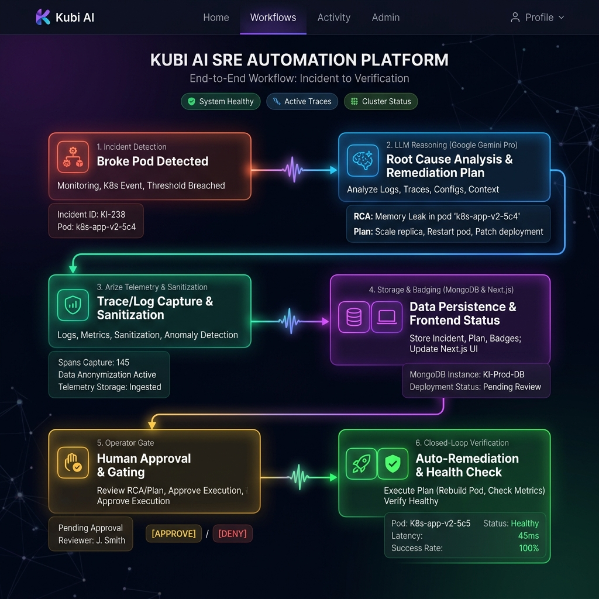
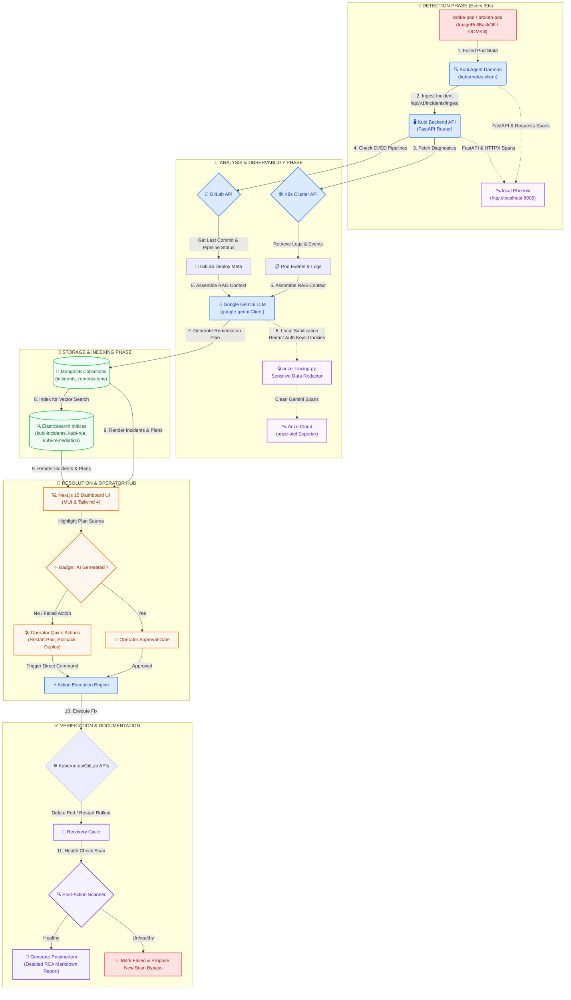

# 🗺️ Kubi AI End-to-End Workflow Architecture

This document presents a comprehensive visual and structural map of the **Kubi AI** autonomous operations platform. It details how pod incidents flow from initial detection through AI-driven Root Cause Analysis (RCA), local or cloud telemetry tracing, operator approval gates, and automated remediation.

---

## 🏗️ Visual Workflow Flowchart

Below is the complete architectural diagram mapping every system interaction, telemetry hook, and persistence layer in the platform.

---

## 📖 Deep-Dive Walkthrough of the Recovery Loop

### 1. Incident Detection & Ingestion
* **Trigger**: A container inside a pod triggers a lifecycle state exception (e.g., `CrashLoopBackOff` or `OOMKilled`).
* **Detection**: The background agent daemon, running inside the cluster namespace, queries namespaced pod schemas every 30 seconds.
* **Ingestion**: It parses the pod status details and securely transmits the payload to the FastAPI `/api/v1/incidents/ingest` endpoint where a clean `"active"` state is default-mapped.
* **Telemetry**: All incoming FastAPI request headers, timing parameters, and body metrics are instrumented using **OpenTelemetry** interceptors.

### 2. Context Extraction (RAG) & LLM Reasoning
* **Retrieval**: The backend connects to the K8s Core API to fetch structural pod logs, container status summaries, and active cluster events.
* **Deployment Context**: Simultaneously, the backend queries the GitLab CI/CD API to check the latest pipeline runs, deployment commits, and runner logs.
* **Synthesis**: This collected infrastructure data is formulated as localized Retrieval-Augmented Generation (RAG) context.
* **LLM Reasoning**: The backend feeds this context directly to **Google Gemini**. Gemini performs SRE-grade reasoning to outline the Root Cause Analysis (RCA) and formulate a highly structured step-by-step recovery recipe.

### 3. Sanitization & Observability Pipeline
* **Security Interceptor**: Before any traces are transmitted outside the cluster, the `arize_tracing.py` redaction middleware iterates through all span metadata.
* **Filtering**: Replace sensitive headers (e.g., `Authorization`, `X-API-Key`, `Cookie`, `gitlab-private-token`) and body fields (e.g., `password`, `secret`, `token`) with a secure `[REDACTED]` placeholder.
* **Telemetry Export**: Sanitized spans are securely exported:
  * **To Local Phoenix**: Sent via HTTP/OTLP to your developer machine dashboard at `http://localhost:6006`.
  * **To Arize Cloud**: Exporter sends directly via secure HTTPS/gRPC to your enterprise observability space.

### 4. Storage, Vector Indexing, & Badging
* **Metadata Persistence**: The incident states and structured remediation plans are stored in MongoDB.
* **Semantic Search**: Spans and RCAs are concurrently indexed inside **Elasticsearch** cluster indexes (`kubi-incidents`, `kubi-pod-logs`, `kubi-remediation`) to allow vectorized, semantic search of historical postmortems.
* **Badging**: Plans are labeled with `"generated_by": "ai"` dynamically. When loaded in the Next.js UI dashboard, AI-originated plans are rendered with premium glassmorphic **"AI Generated"** badges to alert operators of automated plans.

### 5. Human-in-the-Loop Approval & Manual Interventions
* **Gatekeeping**: Operators review AI-proposed remediations on the high-density Next.js web application.
* **Resolution Path A (Automated)**: Operators click **"Approve & Execute"**. The backend Action Engine executes the K8s patch or triggers the GitLab pipeline rollback automatically.
* **Resolution Path B (Manual Overrides)**: If a remediation fails or is rejected, the dashboard dynamically unlocks resilient operator quick-actions (**"Manually Restart Pod"**, **"Manually Restart Deployment"**, **"Manually Rollback Deployment"**), allowing immediate manual recovery.

### 6. Closed-Loop Verification
* **Post-Action Sweep**: The backend background scanner triggers an immediate, targeted scan of the affected pod's namespace.
* **Success Paths**:
  * **WORKLOAD RESTORED**: If the pod enters a healthy `Running` state, the incident is closed, and a clean **SRE Postmortem Markdown Report** is generated and archived for audit compliance.
  * **WORKLOAD FAILS**: If the recovery is unsuccessful, the system flags the incident status as `failed_verification` or `failed_execution` and automatically unlocks scan-skip overrides, allowing Gemini to re-analyze and propose a secondary, alternative recovery recipe.
