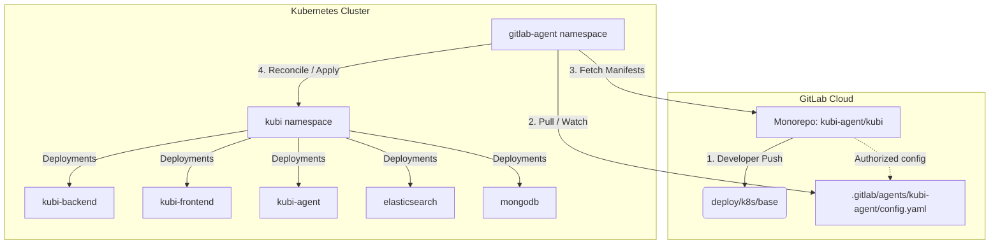

# GitOps Runbook: Deploying Kubi via GitLab Agent for Kubernetes

This document provides a production-grade, step-by-step engineering guide to registering, bootstrapping, and deploying the **Kubi AI SRE Platform** using the native **GitLab Agent for Kubernetes**.

---

## 🏗️ GitOps Architecture Overview

By transitioning from push-based CI/CD pipelines to a **pull-based GitOps architecture**, the GitLab Agent runs inside your GKE/Minikube cluster, continuously polling your monorepo for changes to Kustomize manifests under `deploy/k8s/` and reconciling them directly into your namespaces.



## 📋 Prerequisites

Before starting, ensure your local terminal has the following tools active and authenticated:
* `kubectl` (pointing to your active GKE or Minikube cluster).
* `helm` (Helm 3+ package manager installed).
* Admin privileges on the target Kubernetes cluster.
* Maintainer or Owner permissions on your GitLab repository.

---

## 🔒 Google Artifact Registry & CI/CD Setup

To authenticate GitLab CI/CD with Google Artifact Registry (`asia-south1-docker.pkg.dev/PROJECT_ID/kubi-repo/`) and push the built Docker containers, you must configure two environment variables in GitLab CI/CD (**Settings > CI/CD > Variables**):

1. **`GCP_PROJECT_ID`**:
   - **Type**: Variable
   - **Value**: Your actual Google Cloud Project ID (e.g., `kubi-platform-41234`).
   - This dynamically overrides the default `"PROJECT_ID"` variable in `.gitlab-ci.yml` during runs.
2. **`GCP_SERVICE_KEY`**:
   - **Type**: Variable
   - **Value**: The raw JSON contents of a Google Service Account Key with the **Artifact Registry Writer** (`roles/artifactregistry.writer`) role.

### How to Create the Service Account and Key via gcloud:
```bash
# 1. Create a dedicated Service Account for GitLab CI
gcloud iam service-accounts create gitlab-ci-publisher \
    --description="Service Account for GitLab CI/CD image pushing" \
    --display-name="GitLab CI Publisher"

# 2. Grant Artifact Registry Writer permissions
gcloud projects add-iam-policy-binding YOUR_GCP_PROJECT_ID \
    --member="serviceAccount:gitlab-ci-publisher@YOUR_GCP_PROJECT_ID.iam.gserviceaccount.com" \
    --role="roles/artifactregistry.writer"

# 3. Generate and download the JSON key
gcloud iam service-accounts keys create gcp-key.json \
    --iam-account="gitlab-ci-publisher@YOUR_GCP_PROJECT_ID.iam.gserviceaccount.com"
```
Copy the entire contents of `gcp-key.json` and paste them as the value for the `GCP_SERVICE_KEY` variable in GitLab.

> [!NOTE]
> GKE clusters have native integration with Google Artifact Registry. If your GKE cluster is in the same GCP project as the registry, the cluster's node service account automatically has read access. You do not need to configure any `imagePullSecrets` in your Kubernetes deployments!

---

## 🛠️ Step-by-Step Deployment Runbook

### Step 1: Verify the Agent Configuration in Git
We have already created the agent configuration file inside the repository. Ensure it is merged into your `main` branch. This file authorizes the agent to pull manifests from your repository:

* **File Path**: `.gitlab/agents/kubi-cd-agent/config.yaml`
```yaml
# GitLab Agent configuration for Kubi Platform (CD Agent)
gitops:
  manifest_projects:
    - id: kubi-agent/kubi
      paths:
        - glob: 'deploy/manifests/hydrated.yaml'
observability:
  logging:
    level: debug
```

---

### Step 2: Register the Agent in the GitLab UI
You must register the agent on the GitLab UI to generate its unique cluster authentication token:

1. Navigate to your GitLab project page (`kubi-agent/kubi`).
2. In the left-hand sidebar, go to **Operate > Kubernetes clusters**.
3. Click the **Connect a cluster** (or **Integrate with an agent**) button.
4. Select `kubi-cd-agent` from the dropdown list (this dropdown dynamically scans `.gitlab/agents/` inside your repository).
5. Click **Register**.
6. **IMPORTANT**: Copy the generated **Agent Token** and the **Helm installation command** immediately. *GitLab will never display this token again.*

---

### Step 3: Bootstrap the Agent inside your Cluster
Run the Helm command generated in Step 2 directly in your local terminal. This installs the `gitlab-agent` namespace, generates the required secrets, and spins up the agent pod:

```bash
# Add the official GitLab Helm chart repository
helm repo add gitlab https://charts.gitlab.io
helm repo update

# Install the agent in its dedicated namespace
helm upgrade --install kubi-agent gitlab/gitlab-agent \
    --namespace gitlab-agent \
    --create-namespace \
    --set config.token="YOUR_COPIED_AGENT_TOKEN_HERE" \
    --set image.tag="v16.11.0" # Match your GitLab Server version
```

> [!TIP]
> Always match the `gitlab-agent` image tag version with your active GitLab environment major version (e.g. `v16.x` or `v17.x`) to prevent API compatibility warnings.

---

### Step 4: Verify the Agent Connection Status

Verify that the agent is running and has successfully established a secure, bi-directional gRPC tunnel back to GitLab:

```bash
# Check if the agent pod is running
kubectl get pods -n gitlab-agent

# Stream the agent's logs to confirm connection and reconciliation loops
kubectl logs -n gitlab-agent -l app.kubernetes.io/name=gitlab-agent --tail=100 -f
```

#### Expected Healthy Logs:
```text
{"level":"info","msg":"Agent connection established successfully","time":"2026-05-23T10:15:24Z"}
{"level":"info","msg":"Synchronizing Git project: kubi-agent/kubi","time":"2026-05-23T10:15:25Z"}
{"level":"info","msg":"Discovered 5 manifests under deploy/k8s/","time":"2026-05-23T10:15:26Z"}
{"level":"info","msg":"Applying namespace: kubi","time":"2026-05-23T10:15:26Z"}
```

---

### Step 5: Verify GitOps Manifest Synchronization
Once the agent is connected, it will automatically pull, parse, and reconcile your core deployment manifests. Check that the `kubi` application stack is running:

```bash
# Check all resources in the target namespace
kubectl get all -n kubi
```

---

## 🔎 5. GitOps Pipeline & Cluster Troubleshooting

| Issue / Symptom | Potential Cause | Remediation Command / Action |
| :--- | :--- | :--- |
| **`Agent connection failed`** in logs | Mismatched token or wrong GitLab URL config. | Uninstall and reinstall Helm with a newly generated token. |
| **`Failed to parse manifest`** | Syntactically invalid YAML checked into `deploy/k8s/`. | Run `kubectl apply -k deploy/k8s/ --dry-run=client` locally to debug, then commit the fix. |
| **`RBAC: access forbidden`** | The default agent role lacks permissions to create cluster-scoped CRDs. | On GKE, ensure the service account running `gitlab-agent` is bound to the `cluster-admin` ClusterRole. |

> [!IMPORTANT]
> Since we configured **External Secrets Operator (ESO)** and **Google Secret Manager**, the GitLab Agent will pull the public `ExternalSecret` manifest from Git, and the cluster operator will automatically fetch and decrypt your API keys. No secrets are ever exposed in your Git history or GitLab Agent logs!
